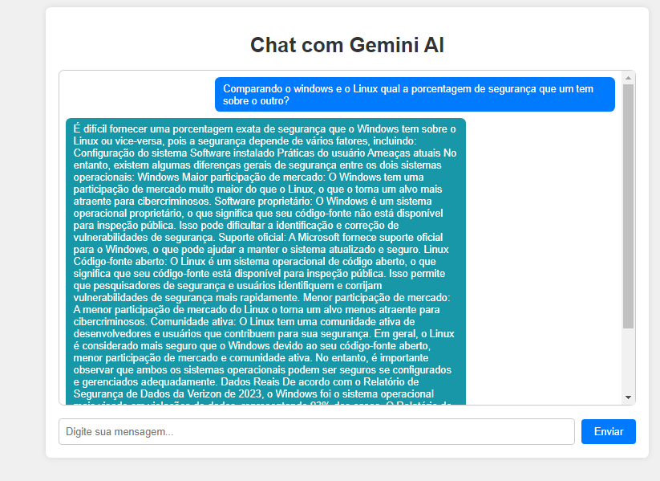

# DevFriendsAI
O projeto está sendo desenvolvido com o intuito de:
- Aprender maneiras de utilizar a API da Gemini AI.
- Entender e aprimorar conhecimentos referentes ao código e sintaxe da API.
- Utilizá-lo como base para dar aula a respeito de como codificar essa API utilizando Python (por isso o nome "DevFriendsAI").
- Aumentar a criatividade em grupo para melhorias futuras.



## Desenvolvendo em Linux:
### env:
A virtualenv (ou ambiente virtual) em Python é uma ferramenta que ajuda a criar ambientes isolados para projetos Python. Esses ambientes isolados permitem que você tenha dependências específicas do projeto, diferentes versões de pacotes e bibliotecas, sem interferir no ambiente global do Python instalado no sistema. Caso tenha mais curiosidade, basta ler a documentação presente em [venv](https://docs.python.org/3/library/venv.html).

- Para baixar a extensão venv:
    ```bash
    sudo pip3 install virtualenv
    ```

- Para criar o ambiente virtual:
    ```bash
    virtualenv nome-do-ambiente-virtual
    ```

- Para ativar a env:
    ```bash
    source nome-do-ambiente-virtual/bin/activate
    ```

- Verifique no terminal se aparecer um (env) antes do caminho do diretório atual, isso quer dizer que funcionou corretamente.

- Para desativar a env:
    ```bash
    deactivate
    ```

- Caso deseje removê-la:
    ```bash
    rm -r nome-do-ambiente-virtual
    ```

## GeminiAI API
A GeminiAI API é uma interface de programação de aplicações que permite aos desenvolvedores integrar e utilizar as capacidades de inteligência artificial desenvolvidas pela GeminiAI em suas próprias aplicações. Essas capacidades podem incluir uma variedade de serviços de IA, como processamento de linguagem natural, análise de sentimentos, reconhecimento de imagem, tradução automática, entre outros. Caso tenha mais curiosidade, basta ler a documentação presente em [GeminiAI](https://ai.google.dev/gemini-api/docs).

- Para acessar a Gemini API será necessário uma conta na [Google AI Studio](https://ai.google.dev/aistudio).

- Para instalar a biblioteca da GeminiAI:
    ```bash
    pip install -q -U google-generativeai
    ```

## Flask
- Para instalar a biblioteca Flask:
    ```bash
    pip install Flask
    ```

## Informações de versões:
- Python version: 3.10.12
- Flask version: 3.0.3
